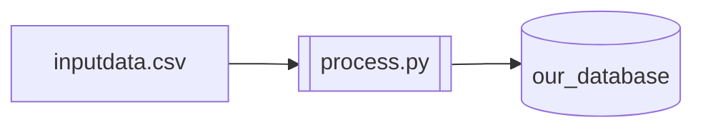
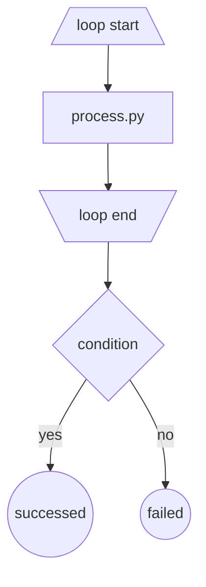
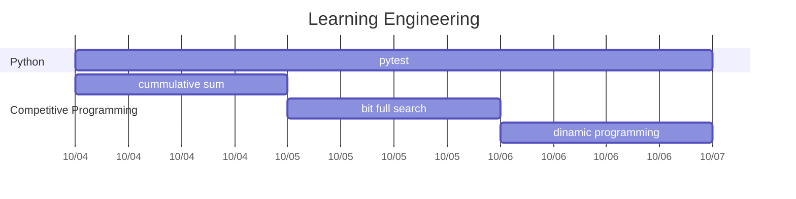

## data flow with graph

```mermaid
%%{init:{'theme':'default'}}%%
graph LR
    A[inputdata.csv]
    B[[process.py]]
    C[(our_database)]
    A-->B
    B-->C
```

## process flow with graph

```mermaid
%%{init:{'theme':'default'}}%%
graph TD
    A[/loop start\]
    B[process.py]
    C[\loop end/]
    D{condition}
    E((successed))
    F((failed))
    A-->B
    B-->C
    C-->D
    D-->|yes|E
    D-->|no|F
    
```
## gantt chart

```mermaid
%%{init:{'theme':'default'}}%%
gantt
    title Learning Engineering
    dateFormat  YYYY-MM-DD
    axisFormat  %m/%d
    excludes weekends

    section Python 
    pytest       :2022-10-04, 3d

    section Competitive Programming
    cummulative sum :2022-10-04, 1d
    bit full search :1d
    dinamic programming:1d
```